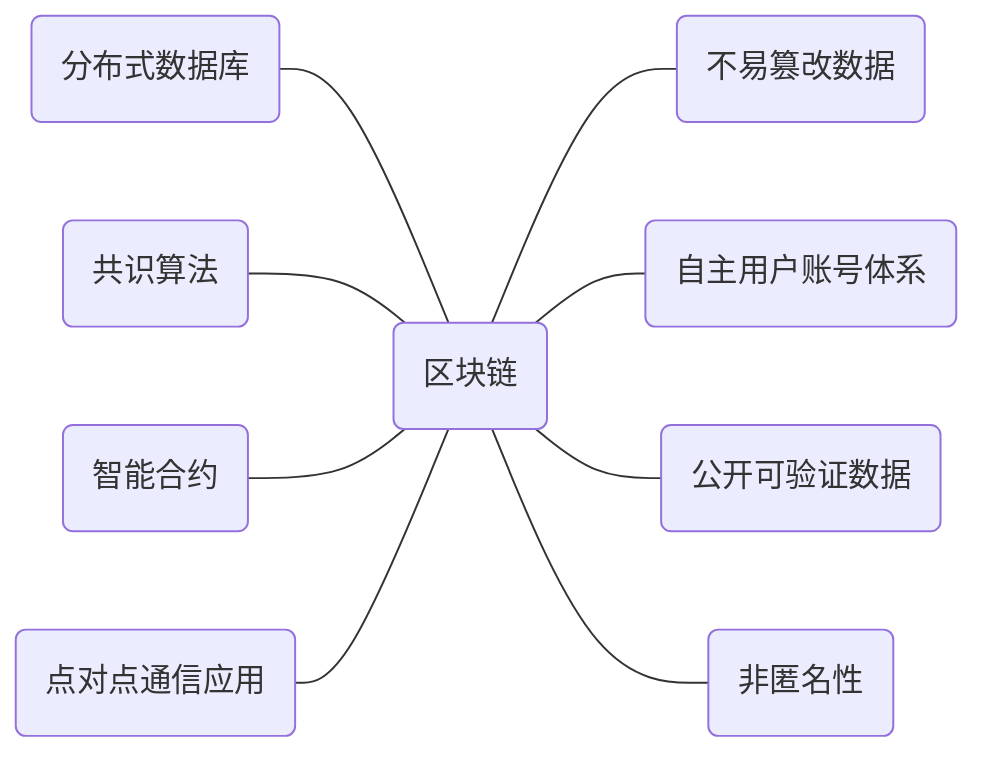
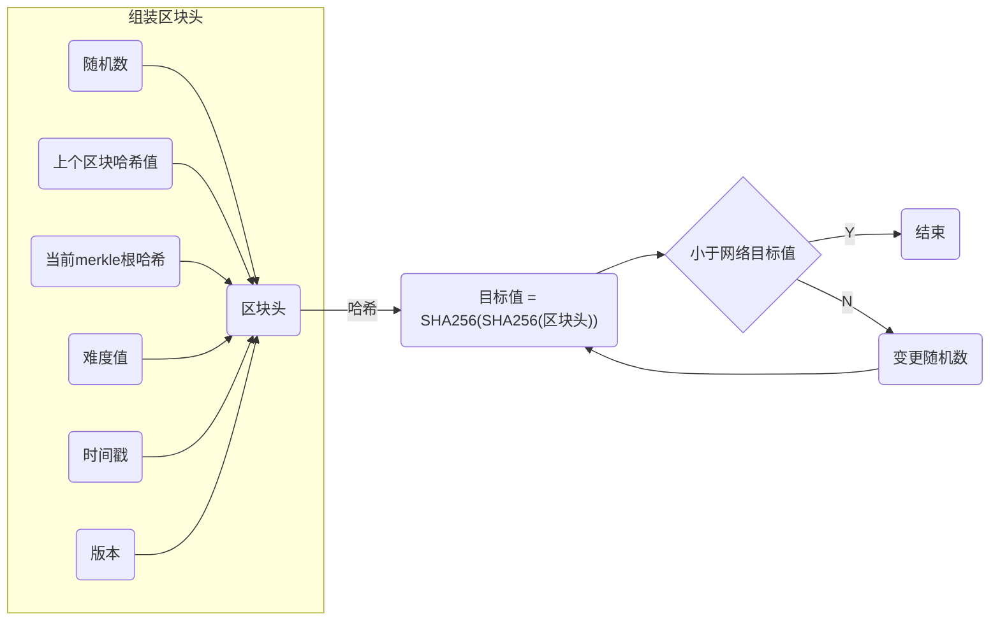
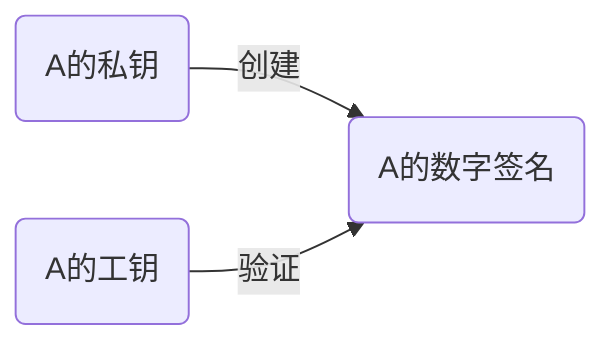
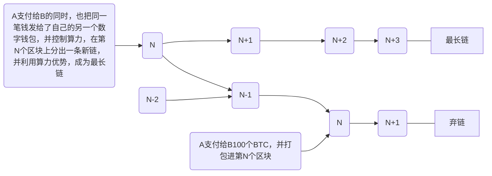

区块链的八种特性

<!--more-->

## 分布式数据库

区块链是一种数据库，而且是一种分布式数据库。

数据库是一种很广义的概念。常用的的关系型数据库有Oracle、MySQL、PostgreSQL等，MongoDB、Redis等属于非关系型数据库，计算机的文件系统本身也可以被认为是一种类型的数据库。

区块链的核心就是数据库，网络上的各个节点上都存储着区块链上的所有数据，可以直接查询到区块链的任何记录，不需要依赖第三方。早期的区块链和虚拟货币有关，主要的数据就是转账交易，所有交易的数据集合就是账本，也正因为如此，区块链技术也被称作“分布式账本技术”(Distributed Ledger Technology, DLT)。随着区块链技术的不断发展，区块链的应用也逐渐扩展到金融以外的领域，其他类型的数据也会存储在区块链上。但出于习惯，我们还是把区块链数据库叫做“账本”，每条记录被称作“交易”。

因为区块链是一种分布式数据库，也就意味着每个节点都需要保存完整的且一样的数据，所需要的成本是很大的。因此，区块链数据库不是效率高的数据库，不适合用来存储海量的数据，通常可以用来存储数据的验证信息，把所有数据都放到区块链上的做法显然是对区块链的一种“误用”。

## 共识机制

既然区块链是一种分布式数据库，每个节点都储存着一份一样的数据，那么当一笔交易发生的时候，我们自然会思考一个问题：如何能保证每个节点的数据库是一致的？在区块链网络中，因为没有一个中心化的服务器，每个节点都有可能篡改交易，而要解决这个问题，必须依赖一种“共识机制”，确保区块链各节点的数据是一致的。

因此，达成共识是一个缓慢的过程，这是为了实现区块链系统的分布式、去中心化等特性必须付出的代价。可以基本肯定的是，区块链系统的性能会低于中心化的系统，追求高性能不是采用区块链技术的首要目标。

共识算法对公链是至关重要的，因为任何人都可以不经任何允许加入区块链网络，也难以在一开始就将不怀好意的节点剔除在外，所以共识算法是保证区块链系统可靠的重要途径。共识算法有很多，区块链中用的最多的是工作量证明（Proof of Work，POW）和权益证明（Proof of Stake，PoS）。

### 工作量证明

工作量证明属于最早问世的共识算法，时至今日依然是区块链中的主流算法，中本聪在2008年发布的比特币白皮书中便引入了这个概念，并用于比特币中。在加密货币没有出现之前，Adam Back提出的HashCash就是工作量证明算法的早期示例。HashCash要求发件人在电子邮件发送前执行运算进行验证，以此缓解困扰收件人的垃圾邮件问题。

#### 双花问题

同一笔钱多次使用就会发生双花问题（Double Spending)。双花问题只会出现在数字货币领域，同一笔现金在现实生活中无法支付两次。例如一个人身上只有一杯星巴克咖啡的钱，是没有办法同时买两杯咖啡的。

但是如果是用数字货币在线上进行交易，就有可能会出现这种情况。我们没办法把一份纸质文件转给多个人，但是我们可以把电子文件复制粘贴，发送给多个人。数字货币在系统里就是一条记录，我们必须防止他人进行复制，在不同的地方支付同一笔钱，造成整个货币体系的崩溃。

在区块链中，用户把一笔交易发布到网络中后，必须要经过验证添加到区块链中才会生效。我们可以将区块链网络限定在3人之间的转账，每个人共享一个账本。如果A向B支付两个货币，其他两个人都可以在账本中查验，A支付的两个货币是否有来源，例如A给C转的货币是从C之前向A支付的货币中拿的。

这样我们就有办法去追踪这些货币，例如A试图用之前支付给B的同一笔货币转给C，网络中的每个人都知道这个信息，不会允许这笔无效交易写入到账本中。

对于小团队来说，这种记账的方式很有效。大家可以基于信任，委托某个人代为记账。如果是成千上万个陌生人参与的网络，该选择谁进行记账，毕竟没有人会相信一个陌生人？

这就是工作量证明的用武之地。

#### 工作量证明如何运作

区块链中的多个交易记录打包在一起，成为一个候选区块，只有候选区块成为确认区块，交易才生效。也就是说，交易已添加至区块链。

但是，添加区块的费用并不便宜。工作量证明需要矿工（创建区块的用户）使用算力进行哈希计算求解难题，最先破解难题的矿工获得打包区块的特权。

哈希运算区块数据是指将数据带入哈希函数，从而生成区块哈希值。区块哈希值的作用就像“指纹”，对于每个区块来说都是独一无二的。要想通过逆转区块哈希值来获取输入数据，几乎是不可能的。然而只要掌握输入数据，就可以轻松确认哈希值是否正确。只要把输入提交到函数中，就能查看输出是否相同。

提供到工作量证明中的数据，哈希值须符合特定条件。但是用户不知道如何做到。他们唯一能做的就是把数据带入哈希函数，以此验证是否符合条件。如果不符合，就对数据稍作修改，再得到不同的哈希值。即使只更改数据中一个字符都会产生截然不同的结果，因此根本无法预测输出结果。

创建区块就是猜谜游戏。矿工需要汇总所有要添加的交易信息和其他一些重要数据，然后同时进行哈希运算。由于数据集不变，需添加一个变量信息。否则，输出的哈希值会始终保持一致。这个变量数据称为“随机数”。只要每次试着改变随机数，就会得出不同的哈希值。这一过程就是所谓的“挖矿”。
总而言之，挖矿就是收集区块链数据并借助随机数进行哈希运算，直至找到特定哈希值的过程。如果得出的哈希值符合协议设定条件，即可在网络中发布新区块。与此同时，其他网络参与者可以验证区块并更新自己的区块链，获得同步后的新账本。

工作量证明机制的优势体现在 - 矿工的作假成本高昂，明智的矿工会追求投资回报率，保证收益。但同时，工作量真证明机制会导致巨大的计算资源消耗，引发能源浪费和环保问题，业内一直在尝试寻找其他更经济环保且性能更好的方法。

### 权益证明

权益证明 (POS) 是一种区块链网络共识算法，该算法基于随机选择的验证者来生产并批准区块，验证者通过在区块链内锁定代币来“质押”原生网络代币。权益证明共识算法根据持币数量决定由谁来验证下一个区块，并根据自己的权益质押总额获得奖励，这一点与矿工破解加密难题，传统工作量证明不同。

工作量证明共识需要消耗大量能源，人们普遍认为PoS是其更加环保、更可扩展的版本。

## 公开可验证的数据

公链上的任何数据都是完全公开的，一旦数据上链，任何人都可以看到，而且区块链上的数据是难以删除篡改的。

区块链数据的验证涉及两个重要的密码学技术：一是哈希算法，二是数字签名技术。

每个区块里的数据都会保留经过哈希计算的结果，只要用相同的哈希算法计算一遍区块数据，再对比一下结果，就可以验证区块的数据是否正确。每个区块的数据都会包含前一个区块的哈希结果，这样就意味着一个区块如果被篡改，区块之后的所有区块都需要被篡改。

区块链上的交易都会都包涵用户的数字签名，每个节点都可以独立验证每条数据的签名是否正确，伪造签名几乎是不可能的。

前文提到，区块链不适合用来存储海量的数据，所谓的数据上链，其实并不是把数据本身放入区块链，而是把加密后的数据或者数据指纹（例如数据哈希值）放到区块链上。

## 难以篡改的数据记录

要注意一点的是，区块链上的数据并不是不能篡改，而是“难以篡改”。由于区块链具有分布式的特点，每个节点都可以独立验证，某个节点要想篡改数据，就需要骗过区块链上的所有节点，还需要骗过共识机制，使得所有节点的数据都改变，难度是巨大的。但是，如果一个链上的节点比较少，而且大部分节点掌握在少数人手里，那么篡改数据是完全有可能（[51%攻击](https://academy.binance.com/zh/articles/what-is-a-51-percent-attack))

## 智能合约

智能合约是存储在区块链上的程序，在满足预先确定的条件时会运行这些程序。智能合约工作时遵循“if ... then ..."语句，这些语句被写入区块链网络中，使得代码逻辑可以公开被验证。

以太坊是第一个引入智能合约的区块链，并广受认可。实际上，“智能合约”这个名词具有某种误导性，因为它既不具备“智能”，也并不是我们理解的“合约”，只是一种在区块链上自动运行的代码，配合了一个图灵完备的虚拟机和新的程序设计语言。其实我们在web2的网络中已经接触过智能合约，如果你授权某个信用卡APP在每月还款日自动扣款，那么实际上可以理解为用户和信用卡公司达成了一个协议，只是这个协议是一段代码，允许在条件满足的情况下，自动从账户中扣款。

## 自主账号体系

区块链上的账户是用户自我产生的，通过执行算法，可以获得一个唯一且安全的账户。这和web2的传统互联网服务是完全不同的，用户不需要在平台上填写个人信息，不需要提供各种证明便可以申请账号。

## 区块链并不是真实匿名的

除了一些追求隐私需求的区块链以外，大部分公链的数据都是完全公开的，人们可以看到每一笔交易的信息，包括交易账户和金额，唯一不知道的只是这个账户的真实拥有者是谁。

区块链之所以能保护隐私，一个原因是区块链上的账户信息和真实的用户信息不存在任何对应关系，所以其匿名性要比互联网好，也正因如此，地下交易、暗网、洗钱机构纷纷用加密货币进行交易。

由于区块链的数据是公开的并且可以获取所有历史数据，我们可以通过大数据分析技术来发现交易的典型pattern，比如欺诈行为。