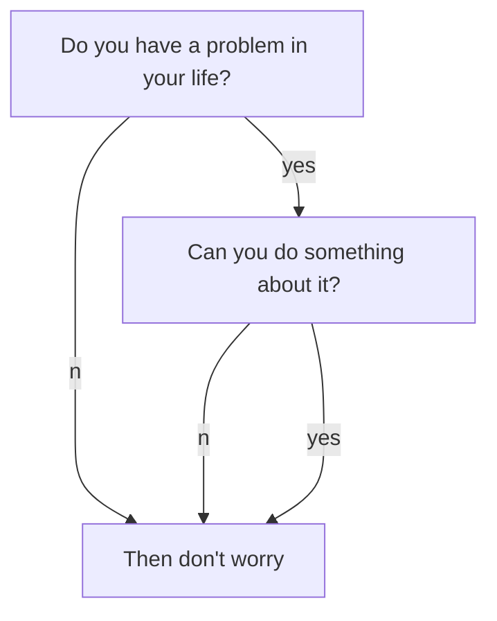

区块链的八种特性

<!--more-->

2018年10月份，中本聪发表了论文[《A Peer-to-Peer Electronic Cash System》](https://bitcoin.org/bitcoin.pdf)，标志着bitcoin的诞生，也意味着世界上第一个真正可运行的区块链诞生。实际上，比特币白皮书中并没有出现“区块链”一词，而是出现了“区块”和“链”。一组交易数据打包储存在一起，叫做区块（block），而把区块按照连接起来，就需要一种数据结构，叫做“链”（chain）。有意思的是，区块链（Block Chain）一词，还是在比特币白皮书发布3年半后，出现在维基百科的条目里。

我们可以引用美国国家标准和技术研究院在2018年10月份发布的重要文献《Blockchain Technology Overview》中对区块链的解释：

"Blockchains are tamper evident and tamper resistant digital ledgers implemented in a distributed
fashion (i.e., without a central repository) and usually without a central authority (i.e., a bank,
company, or government). At their basic level, they enable a community of users to record
transactions in a shared ledger within that community, such that under normal operation of the
blockchain network, no transaction can be changed once published"。

区块链是以分布式方式实现的去中心化的数字账本，不需要银行或者政府这样的权威机构进行担保。链上的交易一旦完成，便难以篡改（此处不写“无法篡改”的原因是当算力足够强大，理论上是可以篡改链上的交易的，后续会介绍“51%算力陷阱”）。在区块链出来之前，任何交易活动都需要有一个第三方中介，两个陌生人之间进行转账，必须经过银行，A把钱打入银行账户，银行再转给B。区块链的本质就是信任机器，一套算法可以确保两个陌生人之间直接进行交易，而不发生任何错误，这才是区块链最核心、最有魅力的地方。

在区块链的世界里，没有一个所谓的中心机构，只有DAO（Decentralized Autonomous Organization，去中心化自治组织），任何人都可以利用区块链软件加入到链上，成为链上的其中一个节点，参与整个DAO的治理和运转。为了确保DAO能够持续运作，需要一套激励机制鼓励所有的节点提供服务，激励的方式就是我们现在常说的虚拟货币，或者token。

但需要明确一点的事，虚拟货币只是区块链技术应用的其中一种形式，随着技术的深入发展，区块链也正在应用于其他领域，如金融服务、商品溯源、数字资产、版权保护、身份验证等。
