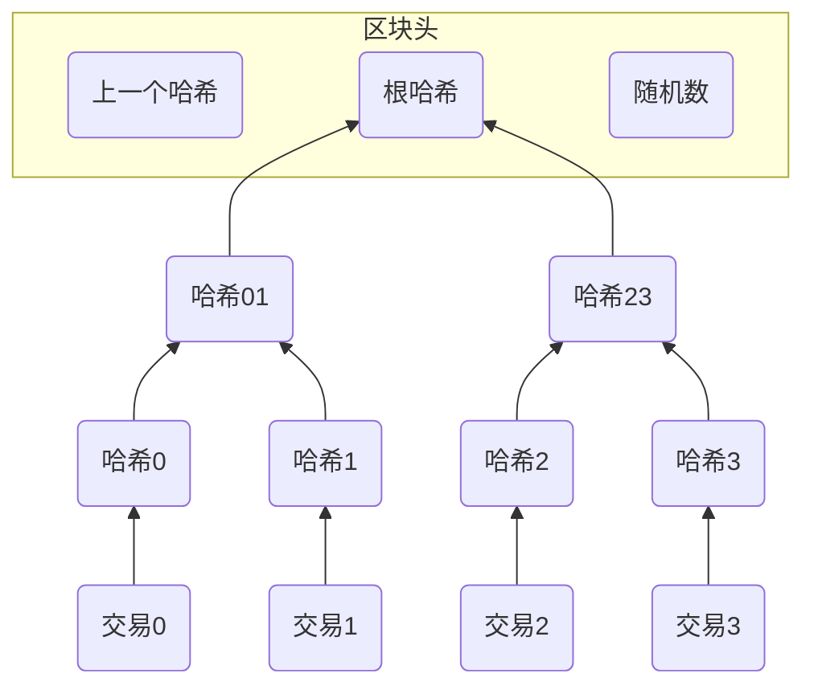
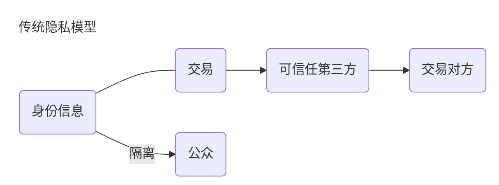
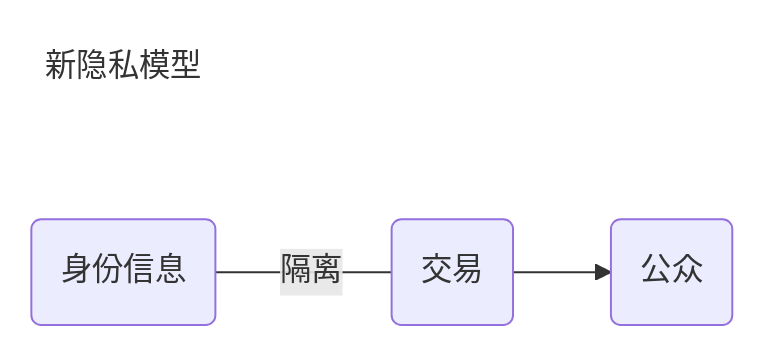

继续解读比特币白皮书5-12章节

<!--more-->

## 5. 网络

运行比特币网络需要6个步骤：
1. 新交易向所有节点广播
2. 每个节点将新交易收集到一个区块
3. 每个节点为它的区块寻找工作量证明
4. 当一个节点找到了工作量证明，就向所有节点广播这个区块
5. 节点只有在区块内所有交易都是有效的且之前没有双重支付的情况下接受这个区块
6. 节点使用这个区块的哈希值作为上一个区块的哈希值记录在新区块中，表示接受了这个区块

节点总是认为最长的链是正确的并持续维护它，如果两个节点同时广播了不同的下一个区块，有些节点可能先收到其中一个，而其他节点先收到另一个。在这种情况下，节点基于收到的第一个区块工作，但是也保存另一个分支防止它变成更长的链。当下一个工作量证明被找到后僵局就会被打破从而其中一个分支变得更长，在另一个分支上工作的节点将切换到更长的链上。

新交易不必广播到所有节点， 只要到达部分节点，不久就会打包进区块。区块广播也能容忍一定程度的信息丢失，如果一个节点没有收到某个区块，它将在收到下一个区块时发现它丢失了一个区块然后去请求这个区块。

## 6. 激励

我们已经知道，比特币系统需要诚实节点通过工作量证明完成复杂计算，达成共识。而节点完成PoW需要耗费大量的成本，如果没有奖励机制，那么没有节点愿意将区块进行打包，整个比特币系统也将无法运转。我们约定，区块中的第一笔交易是特殊交易，专门用于奖励给区块的创建者，也就是“矿工”，同时矿工可以将比特币在市场中进行流通。当固定量的比特币全部进入了流通领域，激励将变成只含有交易费，这样可以避免通货膨胀。

激励机制可以鼓励节点保持诚实，因为攻击者会发现遵守规则比破坏系统获得的收益更大，整个系统便会保持安全稳健。

## 7. 回首磁盘空间

比特币系统中每个节点都会存储并同步所有的历史交易，当交易越来越多的时候，数据量也会变得很大。为了压缩数据，节约存储成本，中本聪引入了默克尔树这样一种二叉树数据结构。

从论文原图可以看到，区块是由区块头和区块体组成，区块头包括上个区块的哈希、随机数和根哈希，区块体是具体的交易两两哈希组成的二叉树。也就是说，不管区块内有多少交易，都可以被哈希进入默克尔树，最终用根节点的哈希值代表所有交易进入到区块头。如果我们想验证区块内存在哈希0的交易，我们只需要知道交易1和哈希23，如果最终算出来的哈希值与根哈希值一致，说明交易0在区块中存在。

默克尔树应用很广泛，其中一个典型的应用场景是P2P下载。在P2P网络中，一个大文件会被分割成无数个小文件，BT下载的时候，会从各个节点下载这些小文件，每个小文件都会有一个哈希值，那么如何证明拼接后的大文件是正确的呢？只需要把每个小文件的哈希值合并在一起再做一次哈希得到根哈希值，如果与正确值一致，则下载的文件是正确的。

中本聪在论文中提到，每个不包含交易的区块头大约是80bytes，如果每10分钟生成一个区块，每年会生成80bytes * 6 * 24 * 365 = 4.2MB，就算区块头要存在内存里，存储也不是问题

## 8. 简化的支付验证

简化支付验证（Simplified Payment Verification, SPV）是指不运行一个完整的网络节点也可以进行支付验证。如果同步一个完整的比特币节点数据，至少需要几百G的磁盘空间，而比特币网络中的大部分节点是不参与挖矿的，因此也不需要知道链上的所有交易，只需要验证和自己有关的交易即可。用户只需要拥有一个最长工作量证明链的区块头即可，并且可以向其他网络查询确保自己拥有最长链，当需要验证交易的时候，只需要将交易链接到对应的默克尔分支， 并且有节点接受了此交易以及后面的区块接受此交易，并最终被整个网络所接受。

当诚实节点控制着网络中大部分算力，简化验证就是安全的，一旦网络被攻击者控制，那么简化验证就会有风险。我们现在看到的比特币钱包分为SPV钱包和全节点钱包，对于绝大多数用户来说，只需要在手机端下载SPV钱包即可，而对于有高频交易的企业级用户或者矿工，则需要使用全节点钱包，以获得链上所有的交易。

## 9. 合并和分割交易额

比特币的每一笔交易可以有多个收款方和多个付款方，当收款方为付款方自己的时候，这就是找零的过程。合并交易既能提高效率，也可以减少手续费。

## 10. 隐私

比特币系统中的所有交易都是公开透明的，任何人都可以看到每笔交易的收付款方，但是不能把交易关联到某个人。这和股票市场是一样的，行情是公开的，但是不会显示交易双方是谁。

## 11.计算

在本章节中，中本聪通过公式和代码论证，比特币网络被攻击的概率是非常低的。假如一个攻击者试图生成一条比诚实链更快的替代链，即使这个目标达到了，也不会使系统变得可以任意修改，比如凭空创建货币或拿走不属于他的钱。节点不会接受无效的交易作为支付，而且诚实节点永远不会接受一个包含无效交易的区块。攻击者只可能改变他自己的某笔交易来拿回他之前已经支出的钱。

诚实链与攻击者链之间的竞争可以用二项随机漫步描述。成功事件是诚实节点被延长一个区块，两条链的差距加1，失败事件是攻击者的链延长一个区块，两条链的差距减1。

攻击者从某一落后位置赶上诚实链的概率类似于赌徒破产理论。假设一个拥有无限信用的赌徒从一定亏损开始，进行无限次的赌博试图达到盈亏平衡。我们可以计算他达到盈亏平衡，即一个攻击者赶上诚实链的概率：

$p$ = 诚实节点找到下一个区块的概率 

$q$ = 攻击者节点找到下一个区块的概率 

$q_z$ = 攻击者从落后$z$个区块赶上诚实链的概率 

$$
 q_z=\begin{cases}
 1 & p\le q \\
 (q/p)^z & p>q
 \end{cases}
$$

当 $p > q$，概率将随着攻击者需要赶上的区块数增加而指数式下降。

假设攻击者在执行完一条交易之后，开始在他秘密准备的另一条链上开始工作，企图拿回之前已经付出的比特币，而当这笔交易被加到区块后， 后面追加了$z$个诚实区块。虽然收款人并不知道攻击者实际的进度，但是假设诚实的区块是按照平均10分钟的速度生成的，攻击者生成区块的进度就会是一个Possion分布，期望值为：

$$\lambda = z\frac{q}{p}$$

为了计算攻击者能赶上诚实节点的概率，我们可以将达到某个进度的泊松概率密度乘以攻击者在那个进度下能赶上诚实节点的概率：

$$
\sum_{k=0}^{\infty} \frac{e^{-\lambda} \lambda ^x}{k!} \begin{cases}
 1 & k>z \\
 (q/p)^{z-k} & k \le z
 \end{cases}
$$

论文还用代码展示了，攻击者追上诚实节点的概率随着$z$呈指数下降。

## 12.总结

在论文的最终一章，中本聪总结到，我们提出了一种不依赖信任的电子交易系统，通过加密算法提供了强有力的所有权控。为了解决双重支付问题，比特币系统引入了工作量证明机制来达成共识，只要诚实节点控制了大部分算力，那么攻击者就无法篡改交易，整个网络就会变得更加鲁棒和稳健。节点无需任何的认证就可以随时加入或者退出网络，激励机制可以鼓励诚实节点维护一个最长链，并拒绝无效的区块。
