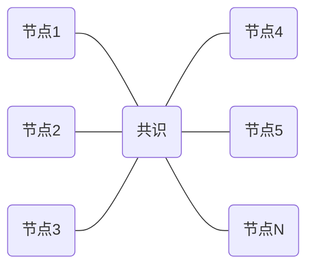

工作量证明PoW和权益证明PoS是两种主流的区块链共识机制。

随着以太坊即将升级到2.0版本，共识机制将向PoS切换，这对以太坊生态有什么影响吗？

<!--more-->

## PoW算法

我们在比特币白皮书讲解的文章已经提到，比特币是通过消耗算力完成工作量证明来保证网络安全的。

PoW算法在1993年首次出现，被应用在对抗垃圾邮件中，但直到中本聪发明比特币后，才开始被大规模使用，成为区块链共识机制的主流算法。

矿工们通过“挖矿”争夺记账权，作为激励，最先完成PoW的矿工将获得比特币。PoW可以保证比特币的交易难以被篡改，但同时也造成两种问题：

第一，那矿工们在建立越来越大的矿场，并消耗大量能源。

[根据剑桥CCAF的数据](https://hbr.org/2021/05/how-much-energy-does-bitcoin-actually-consume)，比特币目前每年消耗约110太瓦时，占全球发电量的0.55%，大致相当于马来西亚或瑞典的年能源消耗量。

第二，矿池的存在会导致区块链变得中心化

矿工的算力越强，就越容易最先完成PoW获得奖励，因此，矿工们选择把各自的算力集中在一起，形成矿池（Mining Pool），并按照算力贡献分摊比特币奖励。如果矿池与矿池之间形成“共谋”，建立矿池垄断集团，就会使比特币网络变得中心化，与去中心的宗旨背道而驰。

为了解决能源浪费和矿池中心化的问题，我们需要找到一个比PoW更好更高效的算法。

## POS算法

2011年，一名叫QuantumMechanic的用户在论坛中首次提出了权益证明（PoS, Proof of Stake）。

PoS的基本思想是，我们在区块链的节点中找到一个验证节点Validor来进行记账，一旦选择成为验证者，节点就必须先质押一定量的token（可理解为押金），谁拥有的token越多，谁就越有可能成为Validator。

假设质押了100块，而B质押了1000块，那么B成为下一个区块验证者的概率要比A高10倍。PoS算法看起来更加偏袒token多的富人，但在现实中，PoS要比PoW更公平。如果是采用PoW算法，大矿主因为具有规模优势，可以以更低的价格获得矿机和电力，

