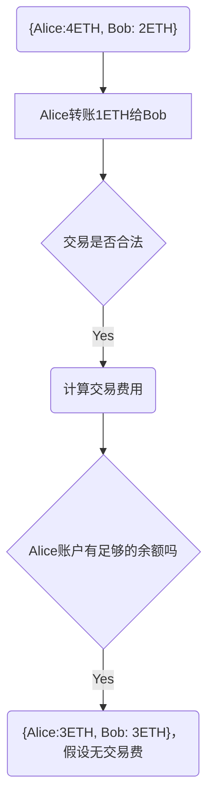

如果用操作系统来类比的话，以太坊就是区块链版本的安卓和ios系统，并且提供开发语言，方便开发者开发各种去中心化的应用程序

<!--more-->

## 什么是以太坊

在往期介绍比特币的文章中，我们提到，比特币本质上是一种特殊的智能合约，一笔交易验证成功后会返回1，失败则返回0。但是比特币存在几个关键的局限性：
1. 缺少图灵完备
比特币系统只能用于比特币交易，无法用做其他用途。比特币脚本语言缺少循环语句，这虽然可以避免交易出现无限循环，但是也造成脚本开发和空间利用的低效。
2. 缺少其他中间状态
比特币的UTXO更像是一种二进制控制位，只能是已花费和未花费两种状态，只能建立简单的一次性合约，不适用于具有中间状态的多阶段合约。
3. Value-blindness价值盲
举个例子，假设你拥有10个比特币，分别来自3个交易：2，3，5。现在你需要转1个比特币给你的朋友，但你的历史交易没有1比特币的记录，因此就没有办法直接转出1个比特币，只能将某笔交易的比特币先全部转出，1个转给对方，其他的再转给自己。这种交易模式无疑会让区块链系统变得更加复杂。
4. Blockchain-blindness区块链盲
UTXO看不到区块链的数据，例如随机数、时间戳和上一个区块的哈希，这导致了功能性扩展受到了限制。

为了解决比特币系统的限制，Vitalik Buterin在2013年提出以太坊的概念，旨在开发下一代智能合约和去中心化应用平台，对标安卓系统和ios系统，如今以太坊已成为第二代的区块链平台，仅次于比特币。

相比于比特币区块链，以太坊不同之处在于，它包括了一个图灵完备的编程语言（Solidity）。利用Solidity，开发人员可以在以太坊上更方便地编写智能合约，同时，以太坊也提供了一个代码运行环境 - 以太坊虚拟机（EVM）。

最初，区块链的用途仅限于金融交易和加密货币，但以太坊降低了程序的开发难度，催生出了各种去中心化应用程序 (dApp) 和去中心化金融 (DeFi)，为我们今天所说的去中心化互联网或Web3奠定了基石。

## 以太坊账户

在以太坊系统中，状态是在两个账户（每个账户有一个20字节的地址）之间转移价值和信息的状态转换构成的。以太坊的账户包含四个部分：

- 随机数，用于确定每笔交易只能被处理一次的计数器
- 账户目前的以太币余额（以太币，以太坊内部的主要加密燃料，用于支付交易费用）
- 账户的合约代码
- 账户的存储（默认为空）

以太坊有两种类型的账户：外部账户（由私钥控制的）和合约账户（存有代码代码账户）。合约账户不能启动运行自己的智能合约，要运行一个智能合约，需要由外部账户对合约账户发起交易，每当合约账户收到一条消息，合约内部的代码就会被激活，允许它对内部存储进行读取和写入，和发送其它消息或者创建合约。

## 以太坊状态

以太坊的状态转换函数：APPLY(S,TX) -> S'，可以定义如下：

- 检查交易的格式是否正确（即有正确数值）、签名是否有效和随机数是否与发送者账户的随机数匹配。如否，返回错误。
- 计算交易费用:fee=STARTGAS * GASPRICE，并从签名中确定发送者的地址。从发送者的账户中减去交易费用和增加发送者的随机数。如果账户余额不足，返回错误。
- 设定初值GAS = STARTGAS，并根据交易中的字节数减去一定量的gas费值。
- 从发送者的账户转移价值到接收者账户。如果接收账户还不存在，创建此账户。如果接收账户是一个合约，运行合约的代码，直到代码运行结束或者gas费用完。
- 如果因为发送者账户没有足够的钱或者代码执行耗尽gas费导致价值转移失败，恢复原来的状态，但是还需要支付交易费用，交易费用加至矿工账户。
- 否则，将所有剩余的gas费归还给发送者，消耗掉的gas费作为交易费用发送给矿工。

## 以太坊应用

以太坊白皮书把以太坊的应用分为三个类型：
- 纯金融应用，包括货币、金融衍生品、钱包等。
- 半金融应用，钱和其他信息结合在一起，例如农业保险的自动赔付
- 完全非金融应用，例如在线投票、去中心化治理、去中心化存储

## 总结

